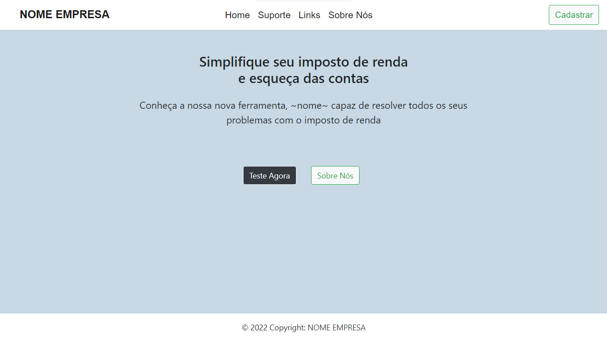
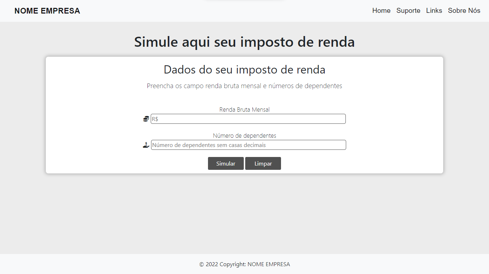
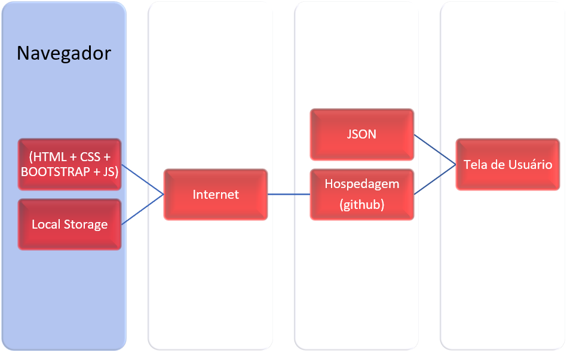

# Informações do Projeto
`TÍTULO DO PROJETO`  

Dificuldade na Declaração do Imposto de Renda

`CURSO` 

Engenharia de Software

## Participantes

Os membros do grupo são: 

> - Diogo Martins de Assis
> - Davi Cesar Martins e Silva
> - Henrique Carvalho Almeida
> - Mateus Estevão de Souza
> - Pedro Afonso De Campos Faria Maciel
> - Vítor dos Santos Moreira

# Estrutura do Documento

- [Informações do Projeto](#informações-do-projeto)
  - [Participantes](#participantes)
- [Estrutura do Documento](#estrutura-do-documento)
- [Introdução](#introdução)
  - [Problema](#problema)
  - [Objetivos](#objetivos)
  - [Justificativa](#justificativa)
  - [Público-Alvo](#público-alvo)
- [Especificações do Projeto](#especificações-do-projeto)
  - [Personas e Mapas de Empatia](#personas-e-mapas-de-empatia)
  - [Histórias de Usuários](#histórias-de-usuários)
  - [Requisitos](#requisitos)
    - [Requisitos Funcionais](#requisitos-funcionais)
    - [Requisitos não Funcionais](#requisitos-não-funcionais)
  - [Restrições](#restrições)
- [Projeto de Interface](#projeto-de-interface)
  - [User Flow](#user-flow)
  - [Wireframes](#wireframes)
- [Metodologia](#metodologia)
  - [Divisão de Papéis](#divisão-de-papéis)
  - [Ferramentas](#ferramentas)
  - [Controle de Versão](#controle-de-versão)
- [**############## SPRINT 1 ACABA AQUI #############**](#-sprint-1-acaba-aqui-)
- [Projeto da Solução](#projeto-da-solução)
  - [Tecnologias Utilizadas](#tecnologias-utilizadas)
  - [Arquitetura da solução](#arquitetura-da-solução)
- [Avaliação da Aplicação](#avaliação-da-aplicação)
  - [Plano de Testes](#plano-de-testes)
  - [Ferramentas de Testes (Opcional)](#ferramentas-de-testes-opcional)
  - [Registros de Testes](#registros-de-testes)
- [Referências](#referências)

# Introdução

## Problema

> A dificuldade que os entrevistados nos mostraram quando abordamos o assunto "Declarar o imposto de renda",
> foram a falta de informação e a complexa linguagem técnica usada para a declaração. 

## Objetivos

> O projeto tem como objetivo criar um software onde:
> - auxilie as pessoas que passam pelas dificudades ditas acima.
> - apresente de modo dinâmico o assunto estimulando as pessoas a fazerem sozinhas.
> - informe as consequências de não declarar o imposto de renda e até mesmo.

## Justificativa

> Durante todo desenvolvimento das crianças e jovens, o Imposto de Renda não é um assunto abordado de maneira direta,
> o que acaba gerando os problemas ditos acima. Do outro lado, existem vários adultos e idosos que não tem uma afinidade
> grande com o processo de declarar o Imposto de Renda e acabam pedindo para terceiros, como os contadores, para fazerem por eles. 

## Público-Alvo

> Jovens que estão entrando na fase adulta e que em um futuro próximo teram que declarar o Imposto de Renda.
> Adultos que já conhecem, ou não, sobre a declaração e terceirizam por acharem muito complexo.
> Pessoas de idade avançada onde apresentam uma dificuldade maior para absorver as regras da declaração.

 
# Especificações do Projeto

> Coletamos informações atraves de entrevistas feitas pelo google forms onde a partir delas conseguimos 
> determinar personas e desenhar seus respectivos mapas de empatia. Juntando as ideias com essas novas 
> informações definimos os requisitos funcionais e os não funcionais.

## Personas e Mapas de Empatia

> João Teodoro da Silva, 68 anos, professor universitário: 
> 1. Muito competente em seu trabalho, mas na questão financeira deixa a desejar.
> 2. Possui rotina árdua, com prazos de entrega a cumprir, e colegas de trabalho para a ajudar.
> 3. Sua personalidade reservada e introvertida o impede de buscar a ajuda humana para questões de seu próprio meio social.
> 4. Uma ferramenta online, seja site ou aplicativo, o ajudaria e muitas em questões de declaração de imposto de renda desde que a mesma
> esclaressa corretamente dados a serem entendidos e expliquem determinados termos, o que poupa tempo e não afetando seu meio profissional.

> Ricardo Martins Xavier, 36 anos, técnico de T.I:
> 1. Produz soluções práticas de grande impacto, tem colegas que o ajudam e gosta de ajudar, não acredita que seus dados na internet estão realmente seguros.
> 2. Possui grande conhecimento na área de desenvolvimento de programas de computador, mas deixa a desejar na área administrativo-financeira.
> 3. Sua personalidade bem humorada o permite ter boas relações sociais, sempre busca ajuda da internet resoluções para seus problemas, sejam de sua própria 
> profissão quanto para seus problemas do dia a dia.
> 4. Por deixar a desejar em questões de conhecimento financeiro, procura uma ferramenta, com linguagem acessível e links úteis para compreender como declarar
> um imposto de renda.

> Elizabeth Clara Lima, 22 anos, estudante de economia:
> 1. Busca seu próprio desenvolvimento pessoal, sempre buscando informações úteis na internet.
> 2. Considera a declaração de imposto uma mera formalidade e que acredita que receita já saiba todos seus tributos, mas a considera necessária, já que há
> consequências para a não declaração.
> 3. Sua personalidade orgulhosa e racional justifica seu empenho para buscar soluções rápidas, possui uma mente aberta, mas quando recebe críticas não
> recebe de bom grado, mas no final acaba absorvendo e aceitando.
> 4. Por ser investidora, uma ferramenta fácil de manusear no quesito declaração de imposto de venda seria uma mão na roda quando se trata da complexidade
> da declaração quando se trata de demonstrar seus investimentos e sua rentabilidade anual.

## Histórias de Usuários

> Eu como professor universitário, uma ferramenta online capaz de me instruir e de me esclarecer sobre requisitos necessários da declaração de imposto de renda
> seria muito útil e de grande ajuda para reduzir meu tempo gasto pois o mesmo é limitado aos meus afazeres profissionais e domésticos, não possuo nínguem para me
> ajudar.

> Eu como técnico de T.I, preciso de um site capaz de me dizer o que fazer para declarar meu imposto corretamente para me auxiliar na parte financeira pois
> não possuo tanta experiência e nem conhecimento nessa área.

> Eu como estudante de economia e investidora, preciso de uma ferramenta para declarar com facilidade meus investimentos e minha rentabilidade anual, 
> com esclarecimento de dados necessários, direcionamento correto com base em meu perfil e ferramentas auxiliares, para que minhas declarações sejam feitas de 
> maneira correta e assim aprendendo como é feito uma declaração.

## Requisitos

As tabelas que se seguem apresentam os requisitos funcionais e não funcionais que detalham o escopo do projeto.

### Requisitos Funcionais

|ID    | Descrição do Requisito  | Prioridade |
|------|-----------------------------------------|----|
|RF-001| Fazer uma eliminação para definir se a pessoa está dentro do nicho de quem precisa declarar ou não | ALTA | 
|RF-002| Permitir que o usuário faça uma simulação do Imposto de Renda | ALTA |
|RF-003| Fornecer acessibilidade as informações referentes a declaração | ALTA |
|RF-004| Indicar para o cliente quais investimentos são necessários declarar e como declarar os mesmos | ALTA |

### Requisitos não Funcionais

|ID     | Descrição do Requisito  |Prioridade |
|-------|-------------------------|----|
|RNF-001| O sistema deve ser responsivo para rodar em um dispositivos móvel | BAIXO | 
|RNF-002| Fornecer dados com uma certa facilidade para compreender | MÉDIO | 
|RNF-003| Segurança de dados sigilosos dos usuarios | MÉDIO |

## Restrições

O projeto está restrito pelos itens apresentados na tabela a seguir.

|ID| Restrição                                                             |
|--|-----------------------------------------------------------------------|
|01| Todo o projeto usando somente frontend |
|02| Não podemos utilizar nenhum banco de dados para manter os dados do cliente sigilosos |

# Projeto de Interface

> A página "Simulação do Imposto de Renda" e a "Conheça seu perfil" são peças fundamentais para atingirmos o objetivo de ajudar 
> nossos clientes que foram baseados nas personas que criamos.

## User Flow

> User Flow com tamanho maior e qualidade superior disponivel no git hub. 
> "https://github.com/ICEI-PUC-Minas-PPLES-TI/plf-es-2022-1-ti1-7946100-declaracao-de-imposto-de-renda/blob/master/docs/relatorio/images/userflow.pdf" 

> 

## Wireframe

> Wireframe com todas as páginas disponivel no git hub. 
> "https://github.com/ICEI-PUC-Minas-PPLES-TI/plf-es-2022-1-ti1-7946100-declaracao-de-imposto-de-renda/blob/master/docs/relatorio/images/wireframe.pdf"

> .jpg)

# Metodologia
 
> Nosso Processo de Design foi dividido em três partes, reuniões presenciais, reuniões online e incrementação ao Design Thinking.
> 
> Inicialmente, iniciamos com reuniões presenciais todos os dias após as aulas para discutirmos superficialmente sobre uma solução para o nosso problema,
> BrainStorm, uma pessoa do grupo foi responsável por preencher de pouco a pouco o BrainStorm devido a disponilidade de horário.
> 
> Nas reuniões online tivemos nosso ponta-pé inicial para o Design Thinking, começamos com incrementações de cada membro do grupo, no detalhamento
> de cada ideia, discutindo em cima de cada uma para procurar a melhor solução para nosso projeto.
> 
> A metodologia durante a incrementação foi a Scrum, onde tivemos o planejamento iterativo e após isso a incrementação ao Design Thinking
> com a colaboração de cada membro do grupo.
> 
> Cada detalhe foi discutido em grupo e analisado por todos os membros, ou seja, do product backlog para o Sprint Backlog, cada atividade foi distribuida
> igualmente entre os membros do grupo, sendo analisada pela quantidade de tarefas, complexidade da tarefa proposta a cada membro e a disponibilidade de
> horário de cada um.
> 
> Após cada tarefa, houve uma revisão de detalhes de cada tarefa feita, com dicussões e planejamento para a próxima tarefa.

## Divisão de Papéis

> Todos os participantes do grupo contribuiram para a produção do Design Thinking (mais especificamente relacionado ao
> ambiente Miro), alguns participantes participaram mais ativamente em determinadas tarefas, segue a lista abaixo:

> - Diogo Martins de Assis: Detalhamento das Ideias, Personas e Mapa de Empatia, parte da Documentação.
> - Davi Cesar Martins e Silva: Slide de Apresentação e entrevista qualitativa.
> - Henrique Carvalho Almeida: User Flow, Protótipo interativo e detalhamento das ideias.
> - Mateus Estevão de Souza: Wireframes, grande parte da Documentação.
> - Pedro Afonso De Campos Faria Maciel: parte da Documentação, User Flow e detalhamento das ideias.
> - Vítor dos Santos Moreira: Documentação, Entrevista qualitativa e User Flow.

## Ferramentas

| Ambiente  | Plataforma              |Link de Acesso |
|-----------|-------------------------|---------------|
| Repositório de código | GitHub | https://github.com/ICEI-PUC-Minas-PPLES-TI/plf-es-2022-1-ti1-7946100-declaracao-de-imposto-de-renda/tree/master/codigo |
| Comunicação | Discord | https://discord.com/ |
| Processo de Design Thinking  | Miro |  https://miro.com/app/board/uXjVOA2lxqk= | 
| Wireframe | Uizard  | https://app.uizard.io/prototypes/LWwYG0A38qiLw6PJ3gBx |
| Protótipo Interativo | Figma  | https://www.figma.com/proto/zcqffDAogv0xIKWOeIZ1sg/TIAW?node-id=1%3A2&scaling=scale-down&page-id=0%3A1&starting-point-node-id=1%3A2 | 

> O editor de código foi escolhido porque ele possui uma integração com o
> sistema de versão. As ferramentas de comunicação e de concepção utilizadas possuem
> integração semelhante e por isso foram selecionadas. 
> Para o wireframe escolhemos o Uizard porque ja tinhamos afinidade com a 
> ferramenta e por fim, para criar o prototipo utilizamos o figma 
> por melhor captar as necessidades da nossa solução.

## Controle de Versão

A ferramenta de controle de versão adotada no projeto foi o
[Git](https://git-scm.com/), sendo que o [Github](https://github.com)
foi utilizado para hospedagem do repositório `upstream`.

O projeto segue a seguinte convenção para o nome de branchs:

- `master`: versão estável já testada do software
- `unstable`: versão já testada do software, porém instável
- `testing`: versão em testes do software
- `dev`: versão de desenvolvimento do software

# Projeto da Solução

## Tecnologias Utilizadas

Neste projeto, html, css, bootstrap e font awesome são usados para estilizar e tornar a página responsiva a qualquer dispositivo. Javascript, popperjs e bootstrap são usados para tornar a aplicação dinâmica. Arquivos em JSON são usados para armazenar dados de clientes e localStorage é usado para armazenar informações temporárias.

No navegador, o usuário acessa o host através da url e se depara com a tela incial

Ao clicar em teste agora, o cliente é levado ao cálculo do imposto

O cliente também pode ler notícias, contatar suporte e acessar links relacionados, este workflow foi mantido até a presente data

## Arquitetura da solução

- Navegador - Interface do usuário
  - Pagina web (html, css, bootstrap, popper e js)
  - Local Storage
    - Número de cliente
- Hospedagem (Github)
  - Inserção de dados
  - Cálculo do imposto

Os componentes da solução são apresentados na figura:

# Avaliação da Aplicação 2
- Acessar o site

- Criar Seu Perfil De Usuario

- Acessar seu relatorio 

- Caso Necessario Acessar o Blog De Artigos
- 

## Plano de Testes

## Ferramentas de Testes (Opcional)

......  COLOQUE AQUI O SEU TEXTO ......

> Comente sobre as ferramentas de testes utilizadas.
> 
> **Links Úteis**:
> - [Ferramentas de Test para Java Script](https://geekflare.com/javascript-unit-testing/)
> - [UX Tools](https://uxdesign.cc/ux-user-research-and-user-testing-tools-2d339d379dc7)

## Registros de Testes
Teste 1:
- Testar a responsividade do site

Teste 2:
- Testar o redirecionamento do botao " simulacao "

Teste 3:
- Entrada de Dados na pagina de simulacao

Teste 4:
- Salvar os dados no localstorage

Teste 5:
- Relatorio emitido no final do processo, teste de funcionalidade

# Referências

......  COLOQUE AQUI O SEU TEXTO ......

- Sites acessados para desenvolver os artigos:
Sobre imposto de renda: https://www.leoa.com.br/blog/imposto-de-renda
Sobre Inss: https://blog.nubank.com.br/o-que-e-inss/
Sobre Pensão alimentícia:https://marcojean.com/pensao-alimenticia/
Sobre Renda Bruta: https://editalconcursosbrasil.com.br/blog/financas-pessoais_renda-bruta-saiba-o-que-e-e-o-que-significa/
Sobre Declaracao De Criptosmoedas: https://blog.nubank.com.br/imposto-de-renda-criptomoedas/
Sobre Aliquota: https://www.suno.com.br/artigos/aliquota/
Sobre Bitcoins: https://economia.uol.com.br/imposto-de-renda/noticias/redacao/2022/04/27/imposto-de-renda-2022-comprou-bitcoins-acima-de-r-5000-precisa-declarar.htm
Sobre Base de calculo: https://meutudo.com.br/blog/base-de-calculo-o-que-e-como-e-feita/
Sobre IRRF: https://ajuda.modalmais.com.br/hc/pt-br/articles/360056937654-O-que-%C3%A9-IRRF-
Sobre Diferenca entre custos, despesas e investimentos: https://www.whow.com.br/diferencas-entre-custos-despesas-e-investimentos/
Sobre Pensao por morte: https://ingracio.adv.br/pensao-por-morte-reforma-da-previdencia/
> no desenvolvimento do trabalho.
> 
> **Links Úteis**:
> - [Formato ABNT](https://www.normastecnicas.com/abnt/trabalhos-academicos/referencias/)
> - [Referências Bibliográficas da ABNT](https://comunidade.rockcontent.com/referencia-bibliografica-abnt/)
